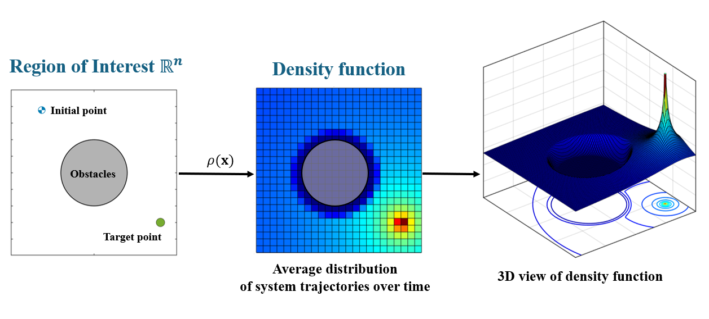
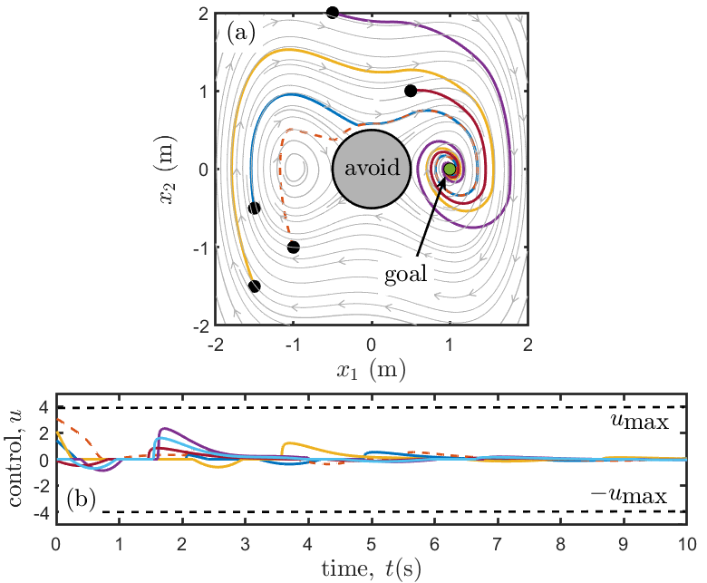
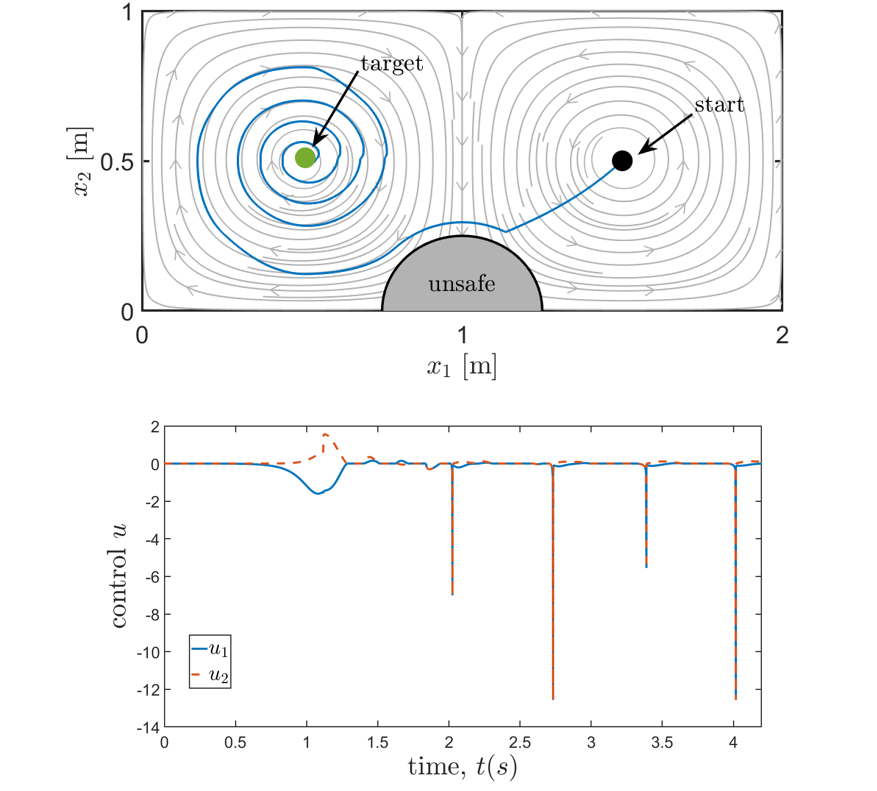
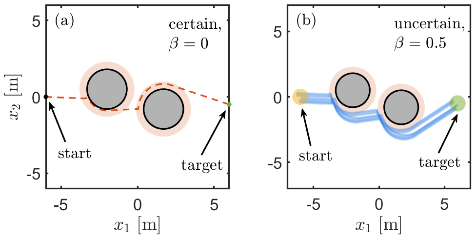
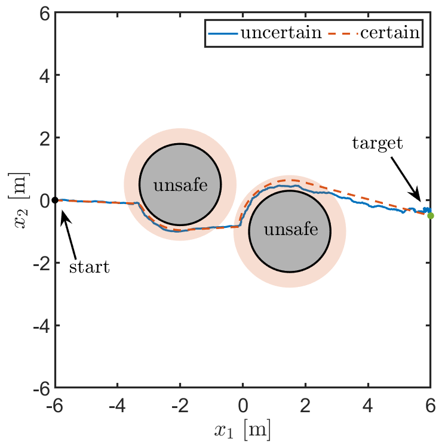
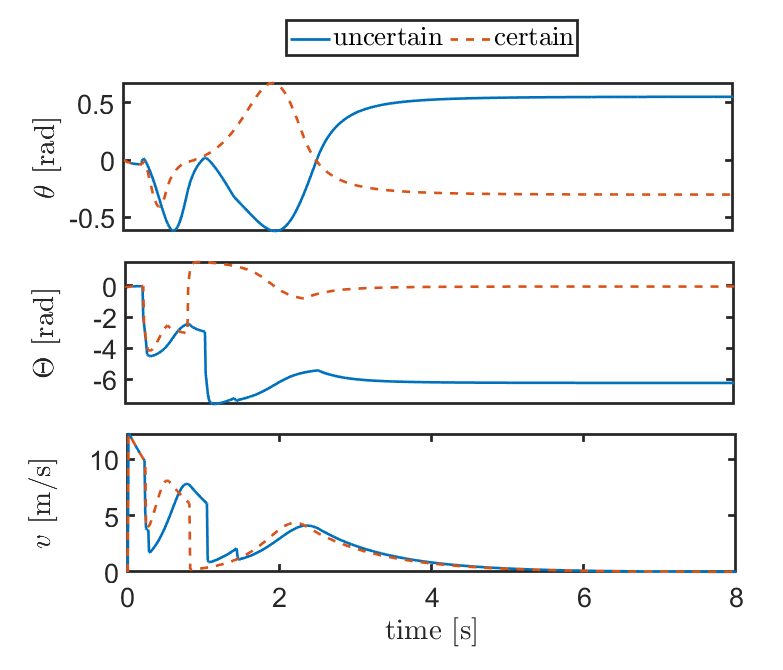
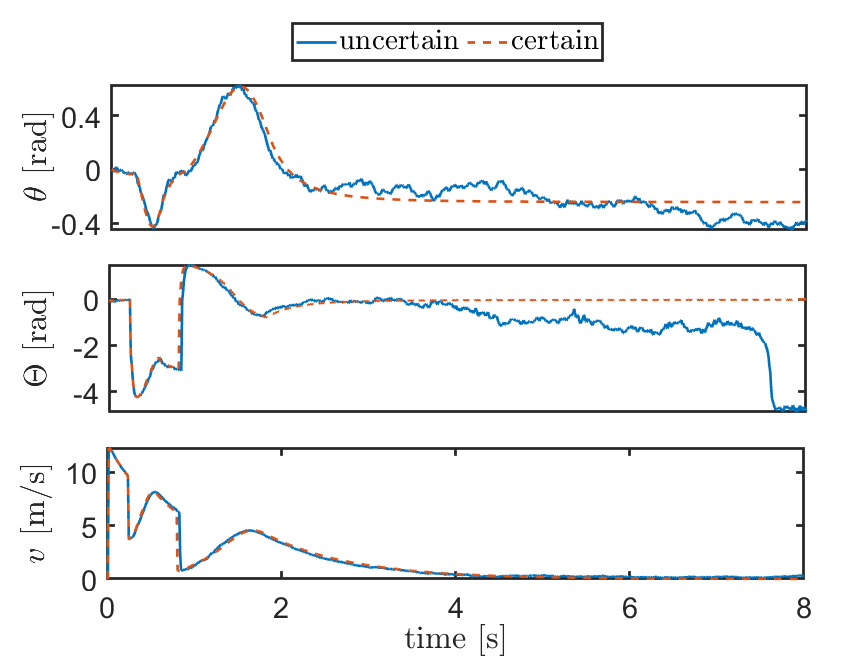

## Overview
We introduce a novel approach for safe control design based on the density function. A control density function (CDF) is introduced to synthesize a safe controller for a nonlinear dynamic system. The CDF can be viewed as a dual to the control barrier function (CBF), a popular approach used for safe control design. While the safety certificate using the barrier function is based on the notion of invariance, the dual certificate involving the density function has a physical interpretation of occupancy. This occupancy-based physical interpretation is instrumental in providing an analytical construction of density function used for safe control synthesis. The safe control design problem is formulated using the density function as a quadratic programming (QP) problem. In contrast to the QP proposed for control synthesis using CBF, the proposed CDF-based QP can combine both the safety and convergence conditions to target state into single constraints. Further, we consider robustness against uncertainty in system dynamics and the initial condition and provide theoretical results for robust navigation using the CDF. Finally, we present simulation results for safe navigation with single integrator and double-gyre fluid flow-field examples, followed by robust navigation using the bicycle model and autonomous lane-keeping examples. Please take a look at the [paper](https://arxiv.org/abs/2407.05133) for high-level details of the framework.

## Running the code
We provide different example folders to showcase the robust safe navigation implemented using the control density function. Run the `main.m` file in each folder to execute the code.

## Examples
We provide safe navigation simulation results for nonlinear systems such as the Duffing oscillator and double-gyre flow field. We also provide robust safe navigation simulation results for bicycle models with uncertainty in initial conditions and uncertainty in the dynamics, as shown below. 
## Safe navigation
Duffing oscillator | Double-gyre flow field
:-: | :-:
 | 

## Robust safe navigation for bicycle model

Bicycle model dynamics:

$\dot{x}_1 = v \cos(\theta + \Phi)$

$\dot{x}_2 = v \sin(\theta + \Phi)$

$\dot{\theta} = \frac{v}{L}\cos\Phi\tan\Theta$

$\dot{\Theta} = \omega$

$\dot{v} = a$

where $\Phi = \tan^{-1}(\frac{l_r\tan\theta}{L})$

Here, $x_1$ and $x_2$ are the position coordinates, $\theta$ is the heading angle, $\Theta$ is the steering angle, and $v$ is the linear velocity. The control inputs to the bicycle model include steering rate $\omega$ and linear acceleration $a$. The parameter $l_r$ represents the distance between the rear wheel and the center of mass, whereas the parameter $L$ represents the total length. 

Uncertainty in initial conditions of position states | Uncertainty in the full state dynamics
:-: | :-:
 | 
 | 
